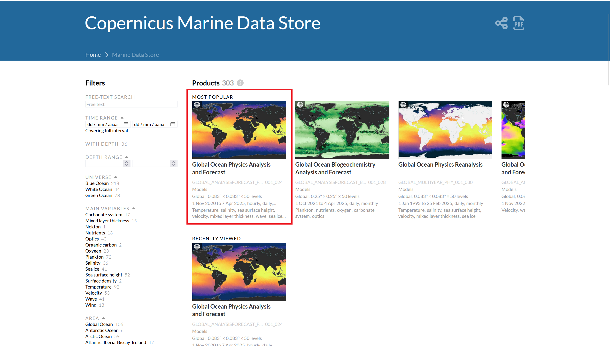
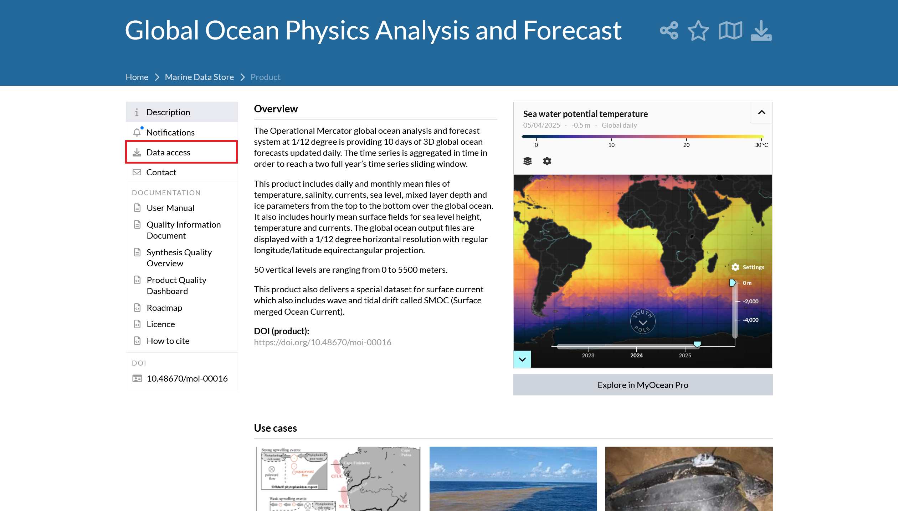
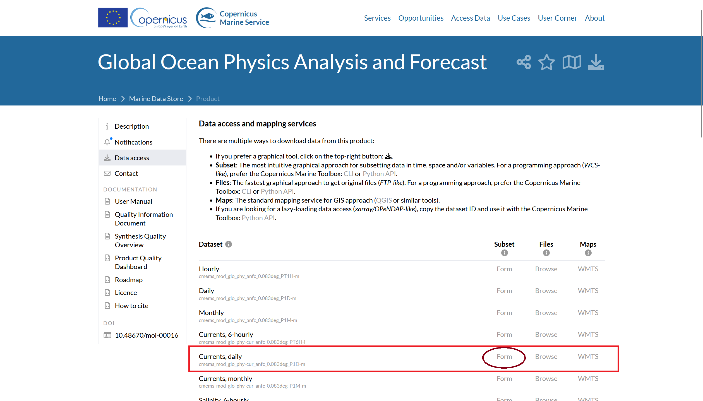
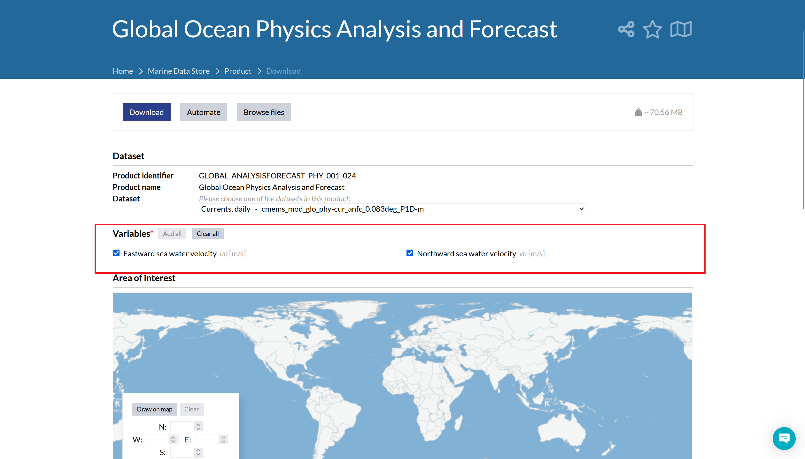

# Oceanic Data API Documentation

## Introduction
The Oceanic Data API simplifies access to oceanographic datasets from the Copernicus Marine service, making it easier for developers to access oceanic data using different programming languages.

## Deployment
```
git clone https://github.com/RafaelF15/Copernicus_Oceanic_Data_API
cd Copernicus_Oceanic_Data_API
```
```
docker-compose up --build
```

## Base URL
http://localhost:8000/ocean-data/
(The port can be changed in the docker files)

## Authentication

To access data from Copernicus Marine, authentication is required. If you do not have an account, register at [Copernicus Marine](https://marine.copernicus.eu/).

Place a `.env` file in the root folder of the API with the following format:

```
COPERNICUS_USERNAME=<your_username>
COPERNICUS_PASSWORD=<your_password>
```

## Endpoints

**Endpoint:**
```
GET /ocean-data/
```

**Query Parameters:**
| Parameter   | Type   | Required | Description                               |
| ----------- | ------ | -------- | ----------------------------------------- |
| dataset\_id | string | Yes      | Dataset identifier from Copernicus Marine |
| min\_lon    | float  | Yes      | Minimum longitude                         |
| max\_lon    | float  | Yes      | Maximum longitude                         |
| min\_lat    | float  | Yes      | Minimum latitude                          |
| max\_lat    | float  | Yes      | Maximum latitude                          |
| min\_depth  | float  | No       | Minimum depth (default: 0)                |
| max\_depth  | float  | No       | Maximum depth (default: surface)          |
| variables   | string | Yes      | Comma-separated list of variables (The variables for each dataset can be found in the copernicus marine webpage for that dataset. Every dataset has different variables.)         |
| start\_date | string | Yes      | Start date in YYYY-MM-DD format           |
| end\_date   | string | Yes      | End date in YYYY-MM-DD format             |

## Example Request
```
GET /ocean-data/?dataset_id=cmems_mod_glo_phy-cur_anfc_0.083deg_P1D-m&min_lon=35.381&max_lon=35.381&min_lat=34.121&max_lat=34.121&variables=uo,vo&start_date=2022-09-16&end_date=2023-12-31
```

## Example Response
```json
[
    {
        "depth": 0.494,
        "latitude": 34.0833,
        "longitude": 35.4167,
        "time": "2022-09-16T00:00:00",
        "uo": 0.0369,
        "vo": 0.3698
    },
    [...]
]
```

## Other information
The available datasets, as well as the id and variables for each dataset can be found in the [Copernicus Marine Data Store](https://data.marine.copernicus.eu/products)

[Dataset used in the example request](https://data.marine.copernicus.eu/product/GLOBAL_ANALYSISFORECAST_PHY_001_024/download?dataset=cmems_mod_glo_phy-cur_anfc_0.083deg_P1D-m_202406)

### How to find the variables for a dataset

1. Choose your product from the Copernicus Marine Data Store


2. Choose the desired dataset from that product and open its form



3. You can now see the variables available for your dataset
